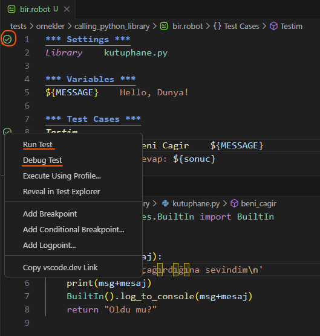
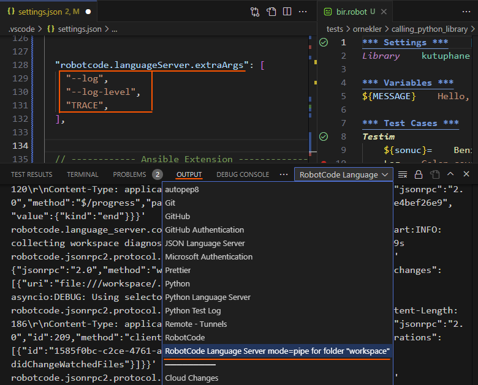
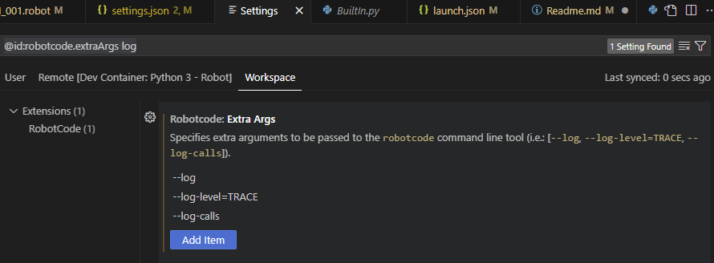
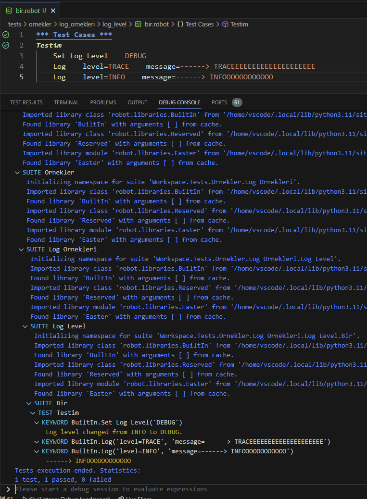
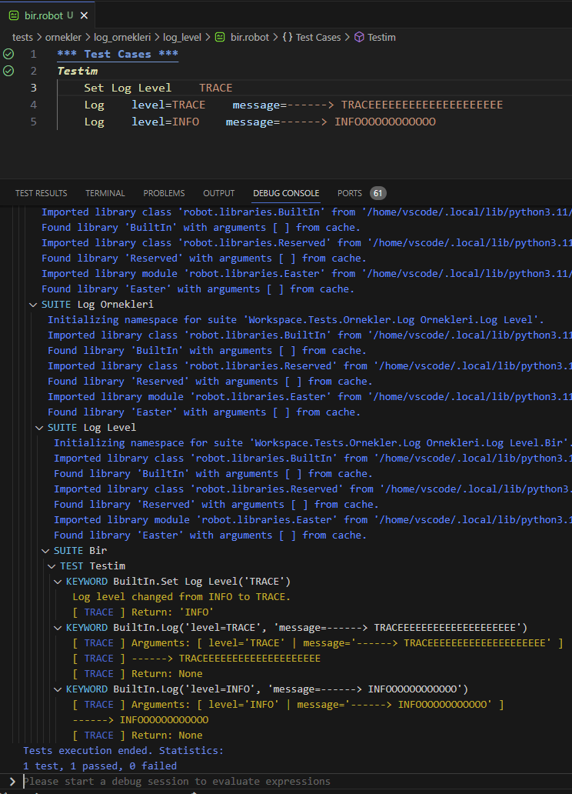

# VS Code Düzenlemesi

# Konteyner İçinde Geliştirmek

- `.devcontainer` dizini içinde VS Code'un bir konteyner yaratıp, kodu içine bağlayarak çalışmamızı sağlayacak dosyalar mevcut.
- `.devcontainer/Dockerfile` dosyasında geliştirme ortamını oluşturmak için kullandığımı yansıyı ayarlarız.
- Konteyner ayaklandığında `.devcontainer/devcontainer.json` dosyasında extensions alanında gerekli uzantılar tanımlıdır. İnternetten hepsi otomatik olarak kurulacak.
- `.robotidy` dosyası ile robot kodlarımı biçimlendirme kurallarını tanımlıyoruz.
- `requirements.txt` Python paketlerini barındırı ve konteyner ayaklandığında hepsi otomatik kurulur.
- `robot.yaml` Eğer komut satırında robot'u çalıştırmak istersek ayarlar bu dosyadan gelecektir
- `version.txt` Test ortamındaki NF paketlerini ve sürüm bilgilerini içerir. Robot test kodları bu dosyayı arar.

# VS Code Ayarları

## Uzantılar

```json
// Extensions sekmesinde "@recommended" yazıp aradığınızda bu "extensions.json" dosyasında yer alan
// ve bu proje için önerilmiş uzantıları yani "recommendations" alanındaki uzantıları görebileceksiniz.
{
  "unwantedRecommendations": [],
  "recommendations": [
    "ms-vscode-remote.vscode-remote-extensionpack",
    "MS-vsliveshare.vsliveshare",
    // Ansible uzantıları
    "redhat.ansible",
    // Python uzantıları
    "ms-python.python",
    "ms-python.autopep8",
    "ms-python.vscode-pylance",
    // Robot uzantıları
    "d-biehl.robotcode",
    // YAML uzantıları
    "esbenp.prettier-vscode" // formatlayıcı
  ]
}
```

## .vscode/launch.json

Aşağıdaki ayar `*.robot` dosyalarında testi başlatmak için bastığınızda RobotCode uzantısı aşağıdaki ayarı kullanır.

Bu çalıştırma ayarında `"attachPython": false,` geldiği için python kütüphane dosyasında breakpoint noktasında duramayız. Bu değeri true yaptığımızda istediğimiz hata ayıklama imkanına kavuşuruz.



```json
{
  "version": "0.2.0",
  "configurations": [
    {
    "name": "RobotCode: Default",
    "type": "robotcode",
    "request": "launch",
    "purpose": "default",
    "presentation": {
        "hidden": true
    },
    // "args": [
    //     "--listener",
    //     "benimlistener"
    // ],
    "attachPython": true,
    "pythonConfiguration": "RobotCode: Python"
    }
```

Yukarıdaki ayar `launch.json` içinde yoksa attachPython değerini burada `false` ile pasifize ediliyorsa

## .vscode/settings.json

### robotcode.languageServer.extraArgs

```json
  "robotcode.languageServer.extraArgs": [
    "--log",
    "--log-level",
    "TRACE",
  ],
```



```json
  "robotcode.extraArgs": [
    "--log",
    "--log-level=TRACE",
    "--log-calls"
  ],
```



Log Level ALL hatalı isimlendirme olur. Çıktılarda bu hatayı görebilirsiniz:


### "robotcode.robotidy.config"

```json
  // kök dizindeki bu dosya içeriğine göre *.robot kodlarını formatlar
  "robotcode.robotidy.config": ".robotidy",
```

```
configure = [
    "MergeAndOrderSections: order = settings,variables,testcases,keywords,comments",
    "OrderSettings: keyword_before = arguments,documentation,tags,timeout",
    "OrderSettingsSection: new_lines_between_groups = 0",
    "AlignSettingsSection: min_width = 18",
    "AlignVariablesSection: min_width = 18"
]
spacecount = 4
transform = [
   "DiscardEmptySections",
   "NormalizeSeparators"
]
```

### "robotcode.robot.args"

Robot komut satırından çalıştırılırken `robot --listener OrnekListener.py --include TEST` gibi bir komutla koşturulur. Eğer `listener` sabit olarak verilecekse aşağıdaki gibi ayarlara eklenebilir.

```json
  /*
   Aşağıda özet kırparak verdiğim komutun "--listener kiwi.KiwiListener" argumanını oluşturur
   ... /usr/local/bin/python /home/vscode/.vscode-server/extensions/d-biehl.robotcode-0.58.0/bundled/tool/robotcode
   --default-path . ... -- -d ./output -P ./ ...
   --listener kiwi.KiwiListener ...
   */
  "robotcode.robot.args": [
    "--listener",
    "kiwi.KiwiListener"
  ],
```

Ya da `launch.json` içinde `"name": "RobotCode: Default",` isimli ayarlara arguman olarak verilebilir:

```json
    ....
      "args": [
        "--listener",
        "benimlistener"
      ],
    ...
```

# Robot İle Spirent Testleri Koşturmak

## Bir Robot Testinin Anatomisi

Bir Robot Framework test senaryosunun hayat döngüsü, _testin başlamasından_ **önce** ve **sonra**sında gerçekleşen olayları içerir. Bu olayları anlamak ve özelleştirmek için "**Test Setup**" ve "**Test Teardown**" bölümleri kullanılır. Bu olayları anlamak ve özelleştirmek için harici shell komutları veya Python kodu kullanarak bu olayları özelleştirebilirsiniz.

Bir test kodunu otomatik biçimlendirmek için robotidy kullanılır. [Bkz.](https://robotidy.readthedocs.io/en/stable/quickstart.html#listing-transformers)

### Test Setup

Test senaryosunun başlamadan önce gerçekleştirilmesi gereken işlemleri tanımladığınız bölümdür. Örneğin, testin önceden koşulları hazırlanabilir veya gerektiğinde bir uygulama başlatılabilir. "Test Setup" bölümünde shell komutları veya Python işlevleri çağrılabilir.

Örnek bir "Test Setup" bölümü göreceğiniz aşağıdaki örnek, "Prepare Test Environment" adlı bir özel anahtar kelimeyi çağırarak bir Python betiği çalıştırır:

```robot
*** Test Cases ***
My Test
    [Documentation]    Sample test case
    [Test Setup]    Prepare Test Environment
    ...

*** Keywords ***
Prepare Test Environment
    Run    python my_setup_script.py
```

Aşağıdaki örnekte, "Prepare Test Environment" adlı özel bir anahtar kelimeyi "Test Setup" bölümünde kullanıyoruz. Bu, test başlamadan önce veritabanı bağlantısı açar.

```robot
*** Test Cases ***
Sample Test Case
    [Documentation]    This is a sample test case
    [Test Setup]    Prepare Test Environment
    Open Browser    http://www.example.com    Firefox
    ...

*** Keywords ***
Prepare Test Environment
    [Documentation]    Prepare the test environment before the test case
    Open Database Connection    my_database    username    password
```

### Test Teardown

Test senaryosu tamamlandıktan sonra gerçekleştirilmesi gereken işlemleri tanımladığınız bölümdür. Bu bölümde test sonuçları kaydedilebilir, uygulamalar kapatılabilir veya test sonrası temizlik işlemleri yapmak veya kaynakları serbest bırakmak için kullanılabilir. Örneğin, veritabanı bağlantısını kapatma, uygulamayı kapatma veya test sonuçlarını kaydetme gibi işlemler burada gerçekleştirilebilir.

Örnek bir "Test Teardown" bölümü:

```robot
*** Test Cases ***
My Test
    [Documentation]    Sample test case
    [Test Teardown]    Clean Up Test Environment
    ...

*** Keywords ***
Clean Up Test Environment
    Run    python my_cleanup_script.py
```

Yukarıdaki örnek, "Clean Up Test Environment" adlı bir özel anahtar kelimeyi çağırarak bir Python betiği çalıştırır.

Aşağıdaki örnekte, "Clean Up Test Environment" adlı özel bir anahtar kelimeyi "Test Teardown" bölümünde kullanıyoruz. Bu, test tamamlandıktan sonra tüm açık tarayıcıları kapatır ve tüm veritabanı bağlantılarını kapatır.

```robot
*** Test Cases ***
Sample Test Case
    [Documentation]    This is a sample test case
    ...
    [Test Teardown]    Clean Up Test Environment

*** Keywords ***
Clean Up Test Environment
    [Documentation]    Clean up the test environment after the test case
    Close All Browsers
    Close All Database Connections
```

### Harici Shell Komutları için `Run` ve `Run Keyword` Komutu

Test senaryosunun herhangi bir yerinde `Run` veya `Run Keyword` komutlarını kullanarak harici shell komutları çalıştırabilirsiniz. Bu komutlar, test senaryosu içinde istediğiniz zaman kullanılabilir.

#### `Run`

Örnek bir harici shell komut kullanımı:

```robot
*** Test Cases ***
My Test
    [Documentation]    Sample test case
    ...
    Run    my_shell_script.sh arg1 arg2
```

Yukarıdaki örnek, "my_shell_script.sh" adlı bir shell komutunu çalıştırır.

#### `Run Keyword`

`Run Keyword` komutu, başka bir test veya anahtar kelimeyi çağırmak için kullanılır. İşte bir örnek:

Önce bir test senaryosu ve birkaç anahtar kelime oluşturalım:

```robot
*** Test Cases ***
Test Example
    [Documentation]    This is a sample test case
    Open Browser    http://www.example.com    Firefox
    Do Something
    Close Browser

*** Keywords ***
Do Something
    [Documentation]    Perform some actions
    Log    This is a custom keyword doing something
```

Yukarıdaki test senaryosu "Test Example" adında bir test senaryosunu tanımlar. Bu senaryo, web tarayıcısını açar, "Do Something" adlı bir özel anahtar kelimeyi çağırır ve sonra tarayıcıyı kapatır.

"Do Something" adlı özel bir anahtar kelime de tanımlanmıştır. Bu anahtar kelime, sadece bir log mesajı görüntüler.

Şimdi, başka bir test senaryosunda `Run Keyword` komutunu kullanarak "Do Something" anahtar kelimesini çağıralım:

```robot
*** Test Cases ***
Another Test
    [Documentation]    This is another sample test case
    Open Browser    http://www.example.com    Firefox
    Run Keyword    Do Something
    Close Browser
```

Yukarıdaki "Another Test" adlı test senaryosu, "Do Something" adlı özel anahtar kelimesini çağırmak için `Run Keyword` komutunu kullanır. Bu, "Another Test" senaryosunu çalıştırırken "Do Something" anahtar kelimesini de çağırır.

Sonuç olarak, "Run Keyword" komutu, başka bir test senaryosunu veya anahtar kelimesini mevcut test senaryosu içinde çağırmak için kullanılır. Bu, test senaryolarınızı daha modüler hale getirip yeniden kullanabilirlik sağlar.

### Harici Python Kodu Çağırmak

Test senaryosunun herhangi bir yerinde Python kodunu çalıştırabilirsiniz. Robot Framework, Python'un bir uzantısıdır ve Python işlevlerini çağırmanıza olanak tanır.

Örnek Python kodu kullanımı:

```robot
*** Test Cases ***
My Test
    [Documentation]    Sample test case
    ...
    Evaluate    my_python_function(arg1, arg2)
```

Yukarıdaki örnek, "my_python_function" adlı bir Python işlemini çağırır.

Robot Framework, bu olayların otomatik olarak gerçekleştiği bir test çerçevesidir, ancak ihtiyaçlarınıza göre özelleştirebilirsiniz. Bu sayede testlerinizin özel başlangıç ve bitiş koşulları sağlayabilirsiniz.

## "RPA Framework" vs. "Robot Framework"

"RPA Framework" ve "Robot Framework", otomasyon ve test otomasyonu için kullanılan iki farklı araçtır. İkisi arasında benzerlikler vardır, ancak farklı kullanım amaçları vardır.

> Bu iki çerçeve farklı kullanım amaçlarına sahiptir ve birbirinin alternatifi değildir. Robot Framework, genel amaçlı otomasyon görevlerini yerine getirmek için kullanılırken, RPA Framework özellikle iş süreçlerini otomatikleştirmek için kullanılır.

```
rpaframework==27.0.1
robotframework==6.1.1
```

### Robot Framework

Robot Framework, genel amaçlı bir otomasyon çerçevesidir ve birçok farklı kullanım senaryosuna uyar. Robot Framework, yazılım test otomasyonundan, süreç otomasyonuna, veri çekiminden, API testlerine kadar bir dizi farklı otomasyon görevini destekler. Robot Framework, açık kaynak bir proje olup geniş bir topluluğa sahiptir ve çok sayıda entegrasyon ve eklenti sunar. Test senaryolarını insanlar için anlaşılır dilde yazmanıza ve kolayca bakım yapmanıza olanak tanır.

### RPA Framework

RPA (Robotic Process Automation) Framework, **iş süreçlerini otomatikleştirmek amacıyla** kullanılır. Genellikle tekrar eden iş süreçlerini otomatikleştirmek ve insan müdahalesini en aza indirmek için kullanılır. Bu tür işler genellikle

- belge işleme,
- veri çekme
- ve iş süreçlerinin otomatikleştirilmesi gibi görevleri içerir.
  RPA Framework, iş süreçlerini otomatikleştirmek için özel olarak tasarlanmıştır ve bu tür işlemlerin daha etkili bir şekilde yapılmasını sağlar.

Ancak bazı senaryolarda, Robot Framework ile RPA Framework bir arada kullanılabilir. Örneğin, bir iş sürecini otomatikleştirmek için RPA Framework kullanırken, test senaryolarınızı Robot Framework ile yazarak otomasyonları entegre edebilirsiniz. Bu, iş süreçlerinizi ve uygulamalarınızı birlikte otomatikleştirmenize olanak tanır.

# Robot Test Örnekleri

## Günlükler (Log)

### Set Log Level

Robot testlerinin `Debug Console` üstünde çıktı seviyesini belirlemek için `Set Log Level` anahtar kelimesini kullanabilirsiniz.





## Ansible

Ansible, otomasyon işlemleri için kullanılan bir araçtır ve doğrudan Robot Framework ile entegre edilemez. Ancak, Python dilinde yazılmış bir kütüphane olan "**ansible-runner**" aracılığıyla Robot Framework ile Ansible görevlerini ve playbook'larını çalıştırabilirsiniz.

Python ile ansible kurmak için conda.yaml içinde ansible paketini otomatik olara kurabiliriz. Elle kurmak için [bu adresi](https://www.tutorialspoint.com/how-to-install-and-configure-ansible-on-windows) takip edebilirsiniz:

```bash
pip install ansible
```

### Örnek 1

Robot Framework ile Ansible'i çalıştırmak için iki ana yaklaşım vardır:

**1. Shell Script ile Ansible Command Line Çağrısı:**

Bu yaklaşım, Robot Framework tarafından kullanılan test senaryolarınızda bir shell komutu kullanarak Ansible komut satırı aracını çağırmanızı içerir. İşte örnek bir Robot Framework test senaryosu:

```robot
*** Test Cases ***
Run Ansible Playbook
    [Documentation]    Run an Ansible playbook using the shell command.
    [Tags]    ansible
    Run    ansible-playbook my_playbook.yml
```

Yukarıdaki örnek, Robot Framework test senaryosunda `Run` anahtar kelimesini kullanarak bir Ansible playbook'ı çalıştırır. Bu senaryo, bir shell komutu olarak çalışır ve belirtilen Ansible playbook'ını çalıştırır.

**2. Robot Framework Ansible Kütüphanesi Kullanımı:**

Robot Framework için özel olarak geliştirilen Ansible kütüphanesini kullanarak Ansible komutlarını ve playbook'larını doğrudan test senaryolarınız içinde çalıştırabilirsiniz. Bu, daha iyi bir entegrasyon ve kontrol sağlar.

Önce Robot Framework Ansible kütüphanesini yüklemeniz gerekecektir:

```bash
pip install robotframework-ansible-library
```

Ardından, Robot Framework test senaryonuzda bu kütüphaneyi kullanabilirsiniz:

```robot
*** Settings ***
Library    AnsibleLibrary

*** Test Cases ***
Run Ansible Playbook
    [Documentation]    Run an Ansible playbook using the AnsibleLibrary.
    [Tags]    ansible
    Run Ansible    playbook=my_playbook.yml
```

Yukarıdaki örnek, `AnsibleLibrary`'yi kullanarak bir Ansible playbook'ını doğrudan çalıştırır. Bu kütüphane, çeşitli Ansible komutlarını ve işlemlerini Robot Framework test senaryoları içinde kullanmanıza olanak tanır.

Hangi yaklaşımı kullanacağınız, ihtiyacınıza ve mevcut altyapınıza bağlı olarak değişebilir. İlk yaklaşım daha hızlı bir şekilde başlamak için kullanışlı olabilirken, ikinci yaklaşım daha fazla kontrol ve entegrasyon sağlar.

### Örnek 2

Bu örnek, "ansible-runner" kullanarak Robot Framework ile Ansible playbook'larını çalıştırmanın temel bir yolunu gösterir. İşte bu kütüphane ile bir Robot Framework test senaryosu yazmanın temel adımları:

1. Öncelikle, "_ansible-runner_" Python kütüphanesini ve Robot Framework'ü (_robotframework_) yüklemeniz gerekecektir.
   Aşağıdaki komutları kullanarak bu kütüphaneleri yükleyebilirsiniz:

   ```bash
   pip install ansible-runner
   pip install robotframework
   pip install robotframework-sshlibrary
   ```

2. Ayrıca, kütüphaneleri Robot Framework projenize eklemelisiniz. Daha sonra, bir Robot Framework test senaryosu oluşturabilirsiniz.

   ```robot
   *** Settings ***
   Library       SSHLibrary
   Suite Setup   Connect To SSH    ${HOST}    ${USERNAME}    ${PASSWORD}

   *** Test Cases ***
   Run Ansible Playbook
       [Documentation]    Run an Ansible playbook using ansible-runner.
       [Tags]             ansible
       ${ansible_result}  Run Ansible Playbook    my_playbook.yml
       Log                Ansible Result: ${ansible_result}
       Should Be Equal    ${ansible_result.rc}    0

   *** Variables ***
   ${HOST}      your_remote_host
   ${USERNAME}  your_ssh_username
   ${PASSWORD}  your_ssh_password
   ```

   Bu örnek, "_SSHLibrary_" ile uzak bir sunucuya bağlanmayı ve "_ansible-runner_" aracılığıyla bir Ansible playbook'ını çalıştırmayı gösterir. Senaryo, "my_playbook.yml" adlı bir playbook'ı çalıştırır ve sonucu denetler.

3. "my_playbook.yml" dosyasını, projenizin kök dizininde veya senaryonun çalıştırıldığı dizinde bulundurmalısınız. Bu playbook, uzak sunucuda çalıştırılacak Ansible görevlerini içermelidir.

4. Yukarıdaki senaryo için, "your_remote_host," "your_ssh_username" ve "your_ssh_password" gibi değişkenleri kendi ortamınıza göre ayarlamalısınız.

5. Senaryoyu çalıştırmak için Robot Framework'ü kullanabilirsiniz. Terminalden aşağıdaki komutu çalıştırarak senaryoyu çalıştırabilirsiniz:

   ```bash
   robot your_test_file.robot
   ```

   "your_test_file.robot" dosyasını kendi test senaryo dosyanızın adıyla değiştirmelisiniz.

### Örnek 3 (ansible-runner)

Öncelikle, "ansible-runner" Python kütüphanesini ve Robot Framework'ü yüklemelisiniz:

```bash
pip install ansible-runner
pip install robotframework
```

"ansible-runner" kullanırken, bu işlem için özel bir Robot Framework kütüphanesini test kodunuzda `Library` ile dahil etmenize gerek yoktur. Bunun yerine, Python kodunuz içinde `ansible-runner` işlemlerini doğrudan çalıştırabilirsiniz.

"ansible-runner" ile çalışmak için Python'un `subprocess` veya `os` modülleri gibi standart kütüphaneleri kullanabilirsiniz. Bu nedenle, `Library` ile başka bir kütüphaneye ihtiyaç duymazsınız.

Örnek bir Robot Framework senaryosu:

```robot
*** Test Cases ***
Run Ansible Playbook
    [Documentation]    Run an Ansible playbook using ansible-runner.
    [Tags]    ansible
    ${rc}    Run Ansible Playbook    my_playbook.yml
    Should Be Equal    ${rc}    0
```

Yukarıdaki örnek, "ansible-runner" kullanarak bir Ansible playbook'ını çalıştırır. Ancak, bu işlem için özel bir kütüphaneyi `Library` ile dahil etmez, sadece Python'un `subprocess` modülünü kullanır.

Bu nedenle, "ansible-runner" işlemlerini doğrudan Python kodunuz içinde yönetebilir ve Robot Framework senaryolarınızda kullanabilirsiniz.

Baştan sona bir örnekle "ansible-runner" kullanalım:

"ansible-runner" kullanarak bir Ansible playbook'ını çalıştırmak için örnek bir Robot Framework senaryosu aşağıda verilmiştir:

Daha sonra, bir Robot Framework test senaryosu oluşturabilirsiniz. Aşağıdaki örnek, bir Ansible playbook'ını çalıştırmak için "ansible-runner" kullanır:

```robot
*** Settings ***
Library    Process
Library    Collections
Library    OperatingSystem

*** Test Cases ***
Run Ansible Playbook
    [Documentation]    Run an Ansible playbook using ansible-runner.
    [Tags]    ansible
    ${ansible_result} =    Run Ansible Playbook    my_playbook.yml
    Should Be Equal    ${ansible_result.rc}    0

*** Keywords ***
Run Ansible Playbook
    [Arguments]    ${playbook_name}
    ${ansible_runner_cmd} =    Set Variable    ansible-runner run ${playbook_name}
    ${result} =    Run Process    ${ansible_runner_cmd}    shell=True    stdout=PIPE    stderr=PIPE
    ${output} =    Convert To String    ${result.stdout}
    Log    Ansible Runner Output: ${output}
    [Return]    ${result}
```

Bu örnekte, "Run Ansible Playbook" adlı bir test senaryosu tanımlanmıştır. Bu senaryo, "my_playbook.yml" adlı bir Ansible playbook'ını çalıştırmak için "ansible-runner" komutunu kullanır. Senaryo, komutun çıktısını kontrol eder ve çıkış kodunu denetler.

Daha sonra, `Run Ansible Playbook` adlı bir özel anahtar kelime tanımlanmıştır. Bu anahtar kelime, "ansible-runner" komutunu çalıştırır, çıktıyı bir log mesajına kaydeder ve sonucu döndürür.

Senaryoyu kullanmak için, "my_playbook.yml" adlı bir Ansible playbook dosyasını projenizin kök dizininde veya senaryonun çalıştırıldığı dizinde bulundurmanız gerekecektir. Ayrıca, bu senaryoyu çalıştırmadan önce Ansible'i sisteminize yüklemiş olmalısınız.

Senaryoyu çalıştırmak için aşağıdaki komutu kullanabilirsiniz:

```bash
robot your_test_file.robot
```

"your_test_file.robot" dosyasını kendi test senaryo dosyanızın adıyla değiştirmelisiniz. Bu şekilde, Robot Framework kullanarak "ansible-runner" ile Ansible playbook'larını çalıştırabilirsiniz.

# Python

Sanal bir ortam yaratarak python ve paketlerini sabitleyeceğiz.

```bash
python -m venv .venv
```

Oluşturulmuş ortamları listelemek:

```bash
python -m venv --list
# veya
virtualenv .venv
```

Bir ortamı faal hale getirip içinde işlem görmek:

```bash
source .venv/bin/activate
```

`requirements.txt` İçinde belirtilen paketleri bu ortama yükleyeceğiz:

```bash
python -m pip install -r requirements.txt
(.venv) cemt@PC-CEM-TOPKAYA:~/_ROBOT/qwe$ python -m pip install -r requirements.txt
Requirement already satisfied: ansible in ./.venv/lib/python3.10/site-packages (from -r requirements.txt (line 1)) (8.4.0)
Requirement already satisfied: ansible-runner in ./.venv/lib/python3.10/site-packages (from -r requirements.txt (line 2)) (2.3.4)
Requirement already satisfied: pymongo in ./.venv/lib/python3.10/site-packages (from -r requirements.txt (line 3)) (4.5.0)
Requirement already satisfied: robotframework in ./.venv/lib/python3.10/site-packages (from -r requirements.txt (line 4)) (6.1.1)
....
```

## Listener

[Listener Arayüzü](http://robotframework.org/robotframework/2.8.7/RobotFrameworkUserGuide.html#using-listener-interface)

```cpp
public interface RobotListenerInterface {
    public static final int ROBOT_LISTENER_API_VERSION = 2;
    void startSuite(String name, java.util.Map attributes);
    void endSuite(String name, java.util.Map attributes);
    void startTest(String name, java.util.Map attributes);
    void endTest(String name, java.util.Map attributes);
    void startKeyword(String name, java.util.Map attributes);
    void endKeyword(String name, java.util.Map attributes);
    void logMessage(java.util.Map message);
    void message(java.util.Map message);
    void outputFile(String path);
    void logFile(String path);
    void reportFile(String path);
    void debugFile(String path);
    void close();
}
```

# SPIRENT

## Test Sunucuları

> http://192.168.13.99:8080/api/testServers

İsteğin cevabı aşağıdaki sunucu bilgileri gibi bir dizi döner:

> {'url': 'http://10.10.20.74:8080/api/testServers/1', 'id': 1, 'name': 'vts-VTO2', 'state': 'READY', 'version': '20.6.1.9'}

Spirent Test Center (STC) veya diğer Spirent test ekipmanlarını kontrol etmek ve yönetmek için kullanılan Spirent API'sinde "testServers" nesnesi, test ekipmanlarının bilgilerini ve özelliklerini almak için kullanılır. "testServers" ile neleri çekebileceğinize dair birkaç örnek şunlar olabilir:

1. **Test Ekipmanlarının Listesi:** "testServers" ile mevcut Spirent test ekipmanlarının bir listesini alabilirsiniz. Bu liste, erişilebilir test ekipmanlarının adlarını, IP adreslerini veya diğer kimlik bilgilerini içerebilir.

2. **Test Ekipmanının Durumu:** Her bir test sunucusunun durumu hakkında bilgi alabilirsiniz. Bu durum bilgileri, bir ekipmanın çevrimiçi mi yoksa çevrimdışı mı olduğunu, kullanılabilirliğini ve çalışma durumunu gösterir.

3. **Test Ekipmanı Konfigürasyonu:** "testServers" ile bir test sunucusunun yapılandırması hakkında bilgi alabilirsiniz. Bu, ekipmanın mevcut yapılandırması, test senaryoları ve kullanılan ayarlar gibi detayları içerebilir.

4. **Test Ekipmanı Sürüm Bilgisi:** Bir test sunucusunun kullandığı Spirent yazılımının sürümü ve diğer kimlik bilgileri gibi teknik bilgilere ulaşabilirsiniz.

5. **Bağlantı Bilgileri:** "testServers" ile test ekipmanlarının bağlantı bilgilerini (örneğin, IP adresi, bağlantı portu) alabilirsiniz.

6. **Kullanılabilir Fonksiyonlar:** Her bir test sunucusunun desteklediği işlevler veya yetenekler hakkında bilgi edinebilirsiniz. Bu, hangi test senaryolarının çalıştırılabileceği veya hangi protokollerin desteklendiği gibi bilgileri içerebilir.

"testServers" nesnesi, genellikle Spirent test ekipmanlarının yönetimi ve otomasyonu için kullanılan API çağrıları sırasında test sunucularının tanımlanması ve bu ekipmanlarla etkileşimde bulunulması için kullanılır. Bu sayede kullanıcılar, test ekipmanlarını uzaktan yönetebilir, test senaryolarını oluşturabilir ve sonuçları alabilirler. Bu işlemler, büyük ve karmaşık ağ testlerinin otomasyonunu sağlamak için önemlidir.

## Library ID

Test kütüphaneleri, belirli test senaryolarını veya yapılandırmalarını kaydetmek ve paylaşmak için kullanılır. Kütüphaneler, test senaryolarının yeniden kullanılabilirliğini artırmak ve ağ testleri sırasında aynı yapılandırmayı tekrar tekrar girmek yerine bu senaryoları kolayca yüklemek için kullanışlıdır.

Kullanıcılar, bu API yoluyla belirli bir kütüphanenin kimlik bilgilerini (libraryIds) alabilirler. Bu kimlik bilgileri daha sonra belirli bir test kütüphanesine yönelik diğer API çağrılarında veya işlemlerinde kullanılabilir. Örneğin, belirli bir kütüphane içindeki test senaryolarını listelemek veya bu kütüphaneyi bir test oturumu oluşturmak için bu kimlik bilgileri kullanılabilir.

# Kütüphane nasıl çalışır?

- Spirent test sunucusu müsait ise
- Test oturumu güncellenir (`test_session_update_mngr`)
- Test koşulur (`run_test_mngr`)

```

```
